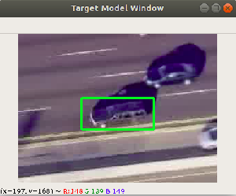

# Visual-Tracking

### How to run the code

 - Run main.py file to launch the application
    

      

         
      

    

 - Choose video you want to load. Click on run
 - Press space to pause the video to choose ROI
    

      

         
      

    

 - Press any other key to start the tracking process
    

      

         
      

    

